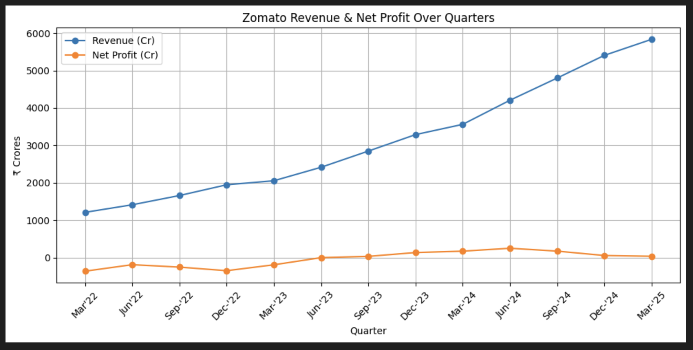

# 📊 Zomato Financial Performance Analysis

**Author:** Pratanu Roy  
**Data Sources:** Screener, Yahoo Finance

---

## 🗂 Files in This Repository

- [`zomato.pdf`](zomato.pdf): Final report with visual trends, regression results, and business insights.
- [`zomato_analysis.ipynb`](zomato_analysis.ipynb): Jupyter notebook for data analysis, EDA, and regression modeling.
- `README.md`: Project summary and navigation.

---

## 📁 Project Summary

This project analyzes **Zomato's (now Eternal)** quarterly performance based on financial KPIs and stock price behavior.  
It combines business context with data science to derive investor-level insights.

---

## 📈 Key Insights

- 📈 Revenue grew from ₹1212 Cr (Mar'22) to ₹5833 Cr (Mar'25)
- 💸 Net Profit turned positive, reaching ₹39 Cr (Mar'25)
- 🧮 EPS improved from -0.46 to 0.04
- 📊 Regression R² = 0.88 — strong correlation with stock price

---

## 🧰 Tools Used

- `Python`
- `pandas`
- `seaborn`
- `matplotlib`
- `scikit-learn`
- `numpy`

---

## 🔍 What You Can Explore

- Business recovery and turnaround analysis
- EPS and Net Profit impact on investor confidence
- Regression interpretation for valuation insights
- Clean visual storytelling through data

---

## 📥 Download Report

👉 [Click here to download the PDF](zomato.pdf)

---

